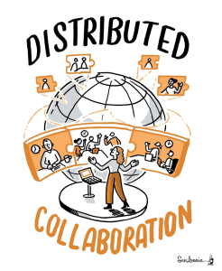
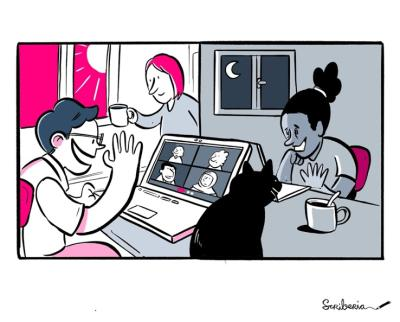

*Originally posted on Software Sustainability Institute's [blog](https://www.software.ac.uk/blog/hybrid-working-how-can-we-avoid-worst-both-worlds-early-career-researchersacademics)*.

{width="600"}

This blog post is part of the [Collaborations Workshop 2022 speed blog series](https://software.ac.uk/tags/cw22-speed-blog-posts). 

The COVID pandemic initiated a paradigm shift in how we work and interact with each other. We moved from a largely on-site work mode to an increasingly hybrid and remote work one. The pandemic has led many people to experiment with working from home and to experience the benefits of reduced commuting. However, it has also highlighted some old problems, such as work-life balance, and created new ones, such as onboarding early career stage researchers. So, what are these problems, and what can be done to tackle them?

The first challenge we want to discuss is the disruption of a worker's local professional network often occurring in the early career stage between short fixed-term job contracts (traditionally for postdoc positions). A highly competitive labour market necessitates frequent moves to new cities or countries and, with this, to change working culture every few years. Typically, a replacement network may be found at the new workplace: the new arrival immediately meets the people who sit near them, and a new local network develops rapidly and organically through casual conversations and social activities. In a hybrid work environment building and maintaining a local network is even more challenging, due to a lack of natural social interactions and a systemic asymmetry between groups working on-site and those working online. This can be exacerbated even more when people of different career levels work online together which increases the asymmetry of opportunities. While searching for solutions, it is important to recognize the presence of these asymmetries and to try balancing them out, for instance, by raising awareness about different challenges of working on-site and remotely so as to set adequate expectations. In our opinion, this issue can be tackled, for example, by providing more opportunities for social interactions both online and in-person and by sustaining a good atmosphere on-site and an informal approach online alongside normal work meetings (informality can foster exchanges of ideas and connections between colleagues!). On the other hand, when somebody gets a new job in a different part of the world, they can retain their existing personal network in two ways: 

- 1. By staying where they are and making new professional connections remotely; 
- 2. By connecting online with the old local professional network while moving to the new workplace and making new local professional network. 

If we cannot avoid the string of fixed-term contracts at this career stage, we can nevertheless facilitate them to be as easy and effective as possible. 

{width="600"}

A second big challenge arises from the variety of communication tools used for remote and hybrid work, barriers to inclusiveness they can introduce, and the asynchronous way in which they are often used. There are many such tools built with different purposes in mind, for example, with focus on messaging and videochat, on collaborative software development, on community and, of course, old traditional email and telephone. Many of these tools are best suited to “asynchronous” communication, which naturally enable remote and flexible work within geographically-dispersed teams. When switching a job, an early career stage academic might need to learn different norms and to adapt to a different set of communication tools used at the new workplace. Even more difficult, when a conference/meeting is conducted in the hybrid mode, a worker joining the event online might feel isolated if the hybrid event is poorly organised. Incorporating physical whiteboards or flip-charts into the online streaming can be difficult and, if managed poorly, remote access to a hybrid event may feel like a “second-class” option. Also, a different etiquette is required for hybrid meetings in contrast to traditional ones. For example, most hybrid platforms have a capability for 1:1 and group text chat and this might become a mechanism for exclusion of early career stage academics in the case of unequal access. To mitigate these challenges, we think special care should be taken to choose which technology to use and how, with extra consideration as to its impact on inclusivity. Unsuitable platforms should not be imposed on teams, but at the same time it is good to be responsive to new options and features as well as changing working-style over the course of a project. Make sure that virtual meetings can include more people. When establishing a format, follow up with remote attendees of hybrid meetings and make sure that everyone’s needs are served. Agree a platform for asynchronous side chat; at a hybrid event, in-person and remote attendees should be equally available.

The third challenge we identified comes from the difference in facilities and services when working at home or the office. The level of noise and distractions at home (due to “invisible” personal responsibilities not necessarily obvious to managers, for example, caring for children and elderly) can get in the way. Given the communication challenges mentioned above, individuals might not be aware of support available to them and might struggle to ask questions and gain access to this as a result. For people with caring responsibilities, they might lack a quiet space from where they can work or attend remote conferences, workshops, trainings, events, etc. In short, lacking the basic facilities and support to perform their work efficiently might hinder individuals significantly. Potential options to alleviate these issues include: 1) Supporting individuals to book co-working spaces near the location of conferences/events/workshops equipped with necessary basic facilities like internet, electricity, work desk and hotline for support; 2) Sharing information about available facilities and support and how to access them through onboarding documents.

{width="600"}

There are many challenges with hybrid working and we’ve selected three broad areas to analyse: networking/community, collaboration and access to facilities/support. If not carefully considered, which are also sometimes applicable in both on-site and remote settings, they can lead to the hybrid workplace becoming worse than in a fully in-person or in a fully remote situation. The solutions we suggested here are the ways, we think, that can help solve or alleviate the challenges that early careers academics and research software engineers often face. To make hybrid working sustainable for them, particular effort needs to be put into building community in the hybrid setting. Crucially though, simply communicating about the existing problems and actively learning with the community and colleagues to see what works best is the first step. And through careful iteration and open discussions of these challenges, we think we can make this new work paradigm the best of both worlds!