#### Hi there!

Thank you for visiting my website! My name is Saranjeet Kaur Bhogal and I'm based in India (Asia). 

I am ... 

- A Statistician by training, 
- An Open Source and Open Science Advocate,
- Lead and Co-Founder of the [RSE Asia Association](https://rse-asia.github.io/RSE_Asia/), 
- Community Manager (Asia) for the [Research Software Alliance (ReSA)](https://www.researchsoft.org), and
- [International Fellow](https://software.ac.uk/about/fellows/saranjeet-kaur-bhogal) of the [2023 Inauguration of the Software Sustainability Institute](https://www.software.ac.uk/blog/2022-12-15-announcing-2023-software-sustainability-institute-fellows?mc_cid=d752d12f28&mc_eid=5ed2e6c258) (SSI Fellow).

Occasionally I'm open to freelance opportunities. [Reach out to me](mailto:kaur.saranjeet3@gmail.com) if you have freelance or other suitable opportunities available.

To have a discussion with me please [book a meeting](https://calendly.com/saranjeetkaur).

$~$

##### Recognition

I have been awarded the Research Software Engineering (RSE) Impact Award 2022, at the inaugural Community Awards by the [Society of Research Software Engineering](https://society-rse.org/).

[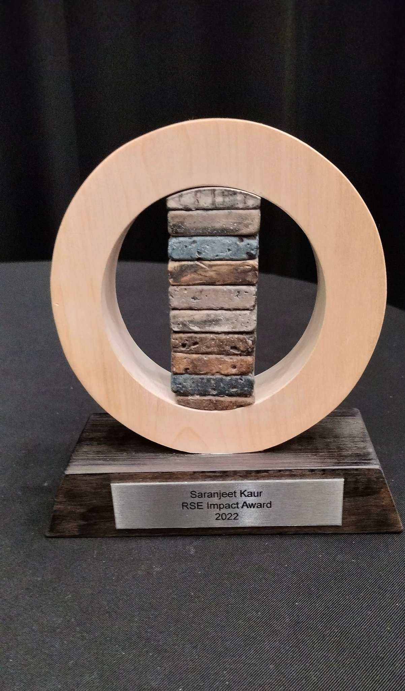{width=30%}](https://society-rse.org/)
[{width=50%}](https://rsecon2022.society-rse.org/announcing-our-community-awards/)

$~$

##### Open Source and Open Science Contributions

[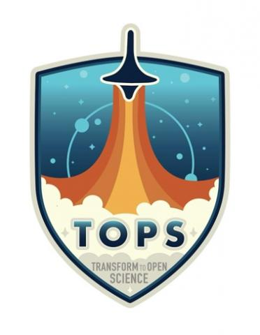{width=10%}](https://science.nasa.gov/open-science/transform-to-open-science)
---
Subject Matter Expert in the [Open Science Tools and Resources](https://github.com/nasa/Transform-to-Open-Science/blob/main/docs/Area2_Capacity_Sharing/OpenCore/OpenCore_leads.md#open-science-tools-and-resources) Module of the the NASA-AGU-TOPS initiative. Developed foundational content for the module with a group of experts.

$~$

[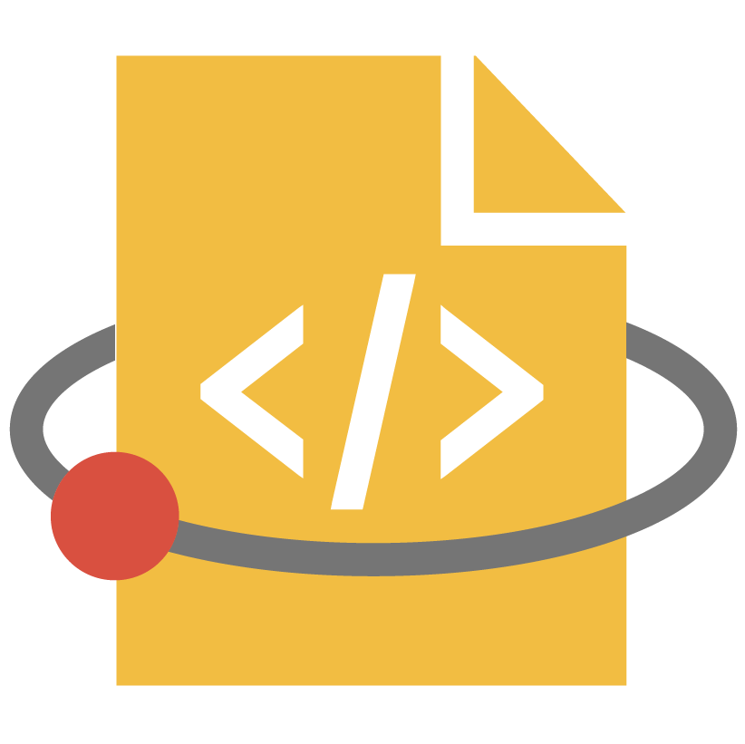{width=10%}](https://developers.google.com/season-of-docs)
---
Using the learnings from the [Digital Infrastructure Incubator](https://incubator.codeforscience.org/) at Code for Science and Society in a project to [Expand and Reorganize the R Development Guide](https://github.com/rstats-gsod/gsod2022/wiki/GSOD-2022-Proposal). For this project I am working as a Technical Writer at [Google Season of Docs 2022](https://developers.google.com/season-of-docs) with [The R Foundation](https://www.r-project.org/foundation/).

$~$

[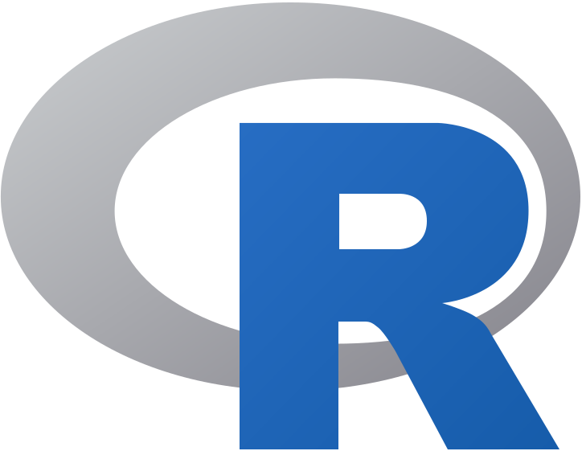{width=10%}](https://contributor.r-project.org/)
---
Written the [R Development Guide](https://contributor.r-project.org/rdevguide/) in 2021 as a project funded by the [R Foundation](https://www.r-project.org/foundation/). Mentor: Heather Turner, Michael Lawrence.

$~$

[{width=10%}](https://summerofcode.withgoogle.com/)
---
Completed the [Google Summer of Code 2020](https://gist.github.com/SaranjeetKaur/37086fea06076bd3ec76d052cc166378) with the Turing team of the Julia language organisation. Mentor: Hong Ge, Cameron Pfiffer, Miles Lucas.

$~$

[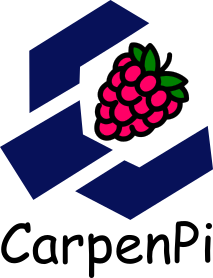{width=10%}](https://carpenpi.github.io/)
---
Created Zine for CarpenPi organization with a funding from the Data Science by Design (DSxD) initiative. 

$~$

##### Upcoming Talks and Sessions

I don't have any upcoming talks yet. [Reach out to me](mailto:kaur.saranjeet3@gmail.com) if you want me to present a talk!

$~$

##### Previous Talks

[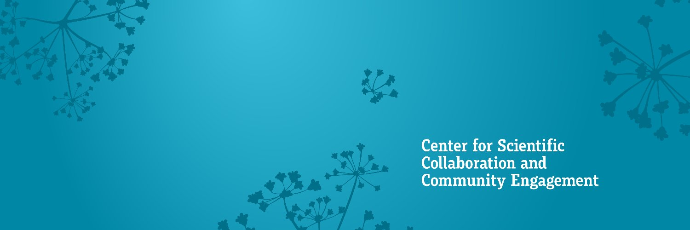{width=20%}](https://www.cscce.org/)
---
[CSCCE Community Call November 2022 ](https://www.youtube.com/watch?v=5HG51sBG3Vs): Invited to participate as a panelist in the [CSCCE's November 2022 Community Call](https://www.cscce.org/2022/11/22/novembers-community-call-recap-community-managers-share-their-strategies-for-engaging-volunteers/) on "Creating fulfilling volunteer opportunities in open source software communities".

$~$

[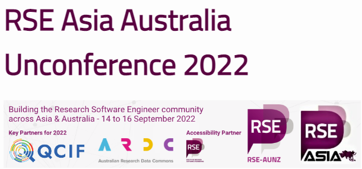{width=20%}](https://rse-aunz.github.io/2022-Asia-Australia-unconference/)
---
[Strategy and Policy Panel at RSE Asia Australia Unconference 2022](https://www.youtube.com/watch?v=xySpuSifZFo&list=PLXLapl_LKb4cjs0740iWwxmZpN18EgPRl&index=13): Participated in the Strategy and Policy Panel of the Unconference and also hosted the Early Career RSE Keynote.

$~$

[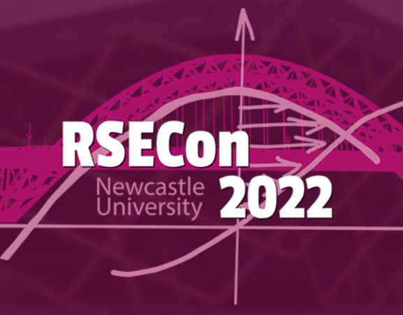{width=20%}](https://rsecon2022.society-rse.org/)
---
[Poster Presentation, Lightning talk, RSE Worldwide Panel, Coding Confessions Panel at RSECon 2022](https://www.youtube.com/watch?v=xySpuSifZFo&list=PLXLapl_LKb4cjs0740iWwxmZpN18EgPRl&index=13): I presented a Poster and corresponding lightning talk of my work based on ‘RSE Asia Association: A year in making’. I was also invited to participate in the RSE Worldwide Panel and the Coding Confessions Panel at this conference.

$~$

[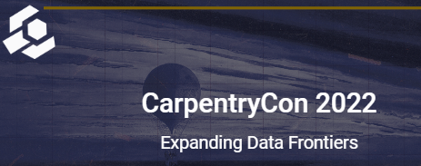{width=20%}](https://2022.carpentrycon.org/)
---
[Lightning talk at CarpentryCon 2022](https://www.youtube.com/watch?v=xySpuSifZFo&list=PLXLapl_LKb4cjs0740iWwxmZpN18EgPRl&index=13): I presented a lightning talk of my work based on ‘Creating reusable lessons using the Carpentries Workbench template’.

$~$

[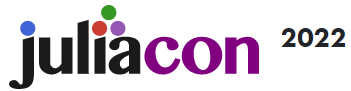{width=20%}](https://juliacon.org/2022/)
---
[Experience talk at JuliaCon 2022](https://www.youtube.com/watch?v=8SSutdRfQ4g): I presented an experience talk of my work based on ‘Community Building using Open Science Principles’. This talk highlighted my work on building the [RSE Asia Association](https://rse-asia.github.io/RSE_Asia/).

$~$

[{width=20%}](https://incubator.codeforscience.org/)
---
[Digital Infrastructure Incubator Graduation Talk](https://zenodo.org/record/6498656#.Ym1-yu1BxPZ): Presented the work and learnings from the Incubator for the project on "Building Community around the R Development Guide" at "The Practice of Digital Infrastructure" session organized by Code for Science and Society. This presentation was alongside five other projects that participated in the Incubator cohort.

$~$

[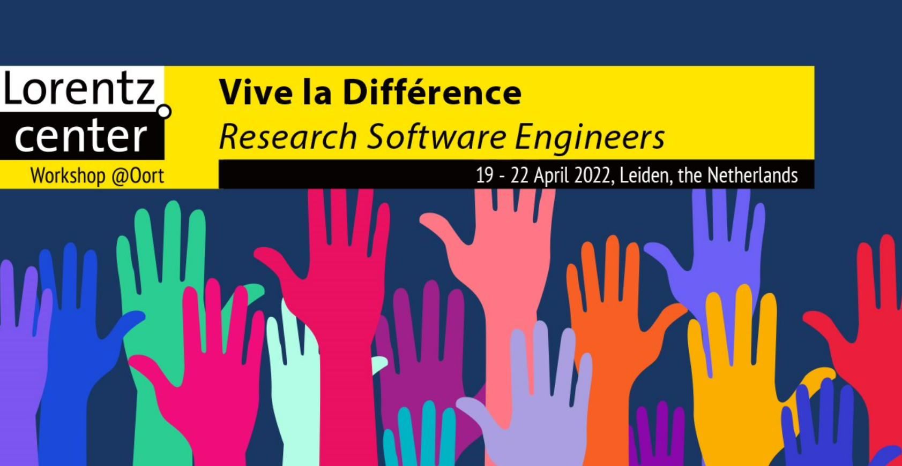{width=20%}](https://www.researchsoft.org/events/2022-04/)
---
[Invited talk](https://zenodo.org/record/6477536#.YmKWZ4VBxPY): Invited to present a talk on “Early career research viewpoint on future vision for DEI in RSE" presented at "Vive la différence - research software engineers" at the Lorentz Centre Workshop organized by the “Research Software Alliance”. It was an hybrid event with an in-person element from 19-22 April 2022 at the Lorentz Centre in the Netherlands; and online events from March-April 2022 across different time zones.

$~$

[{width=20%}](https://software.ac.uk/cw22/lightning-talks)
---
[Lightning talk & Hack Day participation at CollabW22](https://github.com/SaranjeetKaur/RSEAsiaCW22): Presented a lightning talk on "RSE Asia Association: In making" at the Collaborations Workshop 2022 hosted by the Software Sustainability Institute. Also presented a pitch to build a `Carpentries-style Lesson on R's Bug Tracking Process` which secured the 3rd position on the Hack Day. As a part of this task we converted the materials from the Collaboration Campfires (on learning how to contribute to R) into a reusable lesson using The Carpentries Workbench template and the R package `sandpaper`. The lesson created is hosted on the [r-devel GitHub organization](https://github.com/r-devel/r-bug-tracking-lesson).

$~$

[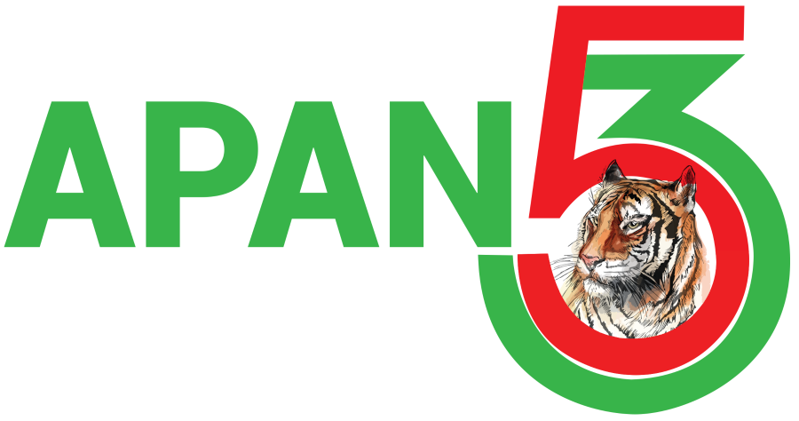{width=20%}](https://apan53.apan.net/)
---
[Workshop talk at APAN53](https://github.com/SaranjeetKaur/APAN53_RSE_Asia): Presented a talk on "Research Software Engineering initiative in Asia region" at Asia Pacific Advanced Network (APAN53, Bangladesh). This talk was a part of the workshop on "Growing research software initiatives and communities in the Asia Pacific".

$~$

[{width=20%}](https://apan53.apan.net/)
---
[Panel discussion at APAN53](https://github.com/SaranjeetKaur/APAN53_Slides_Panel_Discussion): Presented my talk at the Panel Discussion on "https://github.com/SaranjeetKaur/APAN53_Slides_Panel_Discussion" held at APAN53, Bangladesh.

$~$

[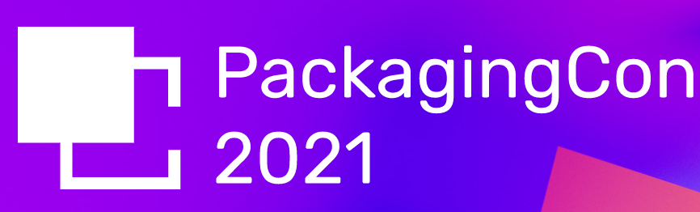{width=20%}](https://packaging-con.org/)
---
[Lightning talk at PackagingCon 2021](https://youtu.be/BpRef4U-4sI?t=121): Presented a lightning talk on “Turing.jl: An Overview”. The talk was an overview of Turing.jl which is a Julia library focusing on Bayesian inference with probabilistic programming. This was the first edition of PackagingCon 2021, which is a conference held with the aim to bring various software eco-systems together. 

$~$

[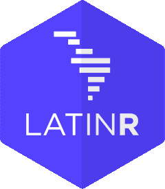{width=20%}](https://latin-r.com/en)
---
[Invited talk at LatinR 2021](https://www.youtube.com/watch?v=VzPia_PAxvw): Presented a Invited talk on “R Development Guide: Motivation, First Draft, and the Way Forward”. This is a Latinamerican conference about the use of R in R&D.

$~$

[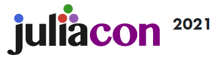{width=20%}](https://juliacon.org/2021/)
---
[Virtual poster presentation at JuliaCon 2021](https://www.youtube.com/watch?v=Q7SYF3wbXwk): I presented a virtual poster of my work based on ‘Algorithmic Variants of Nested Sampling’. I developed these algorithms while working for the Google Summer of Code 2020 with the Turing team of the Julia Language organization. I also moderated the single track sessions of JuliaCon 2021.

$~$

[{width=20%}](https://user2021.r-project.org/)
---
[Regular talk at useR! 2021 - The R Conference](https://youtu.be/2B7H8WJOX40?t=2187https://youtu.be/2B7H8WJOX40?t=2187): In the ‘1A Community and Outreach 1’ session on the ‘R Developer’s Guide’ (now called as the 'R Development Guide'). During the conference, I also attended the tutorials on ‘Contributing to R’ (conducted by Gabriel Becker and Martin Maechler) and ‘Translating R to Your Language’ (conducted by Michael Chirico and Michael Lawrence). I was also the Zoom Host 
for various tutorials and sessions of this international online conference.

$~$

##### Conference Moderator, Interviews, Podcast

- [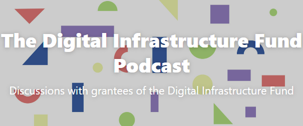{width=20%}](https://dif.fireside.fm/)
---
[The Digital Infrastructure Podcast](https://dif.fireside.fm/8)

- [Google Summer of Code 2022 with the Julia Language - Q/A](https://www.youtube.com/watch?v=yWEmAstJdQ8)

- [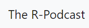{width=20%}](https://r-podcast.org/)
---
[The R Podcast](https://r-podcast.org/034-collaborative-campfires/)

- [{width=20%}](https://juliacon.org/2021/)
---
JuliaCon 2021 moderated sessions: [1](https://www.youtube.com/watch?v=IlFVwabDh6Q), [2](https://www.youtube.com/watch?v=LT4AP7CUMAw), [3](https://www.youtube.com/watch?v=sUyddZQaeyg), [4](https://www.youtube.com/watch?v=6V6jk_OdH-w)

- [Google Summer of Code AMA](https://www.youtube.com/watch?v=YPO9ew6EkkU)

- [{width=20%}](https://whyr.pl/foundation/)
---
[Why R? World Interview](https://www.youtube.com/watch?v=0u-aJhXbLAM)

$~$

##### Community contributions

- [{width=20%}](https://openlifesci.org/)
---
[Project Lead, Open Life Science Cohort-6](https://openlifesci.org/ols-6/projects-participants/).

- [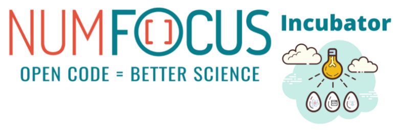{width=20%}](https://numfocus.medium.com/call-for-volunteers-numfocus-project-incubator-3ec7b4567846)
---
Founding Committee Member, NumFOCUS Project Incubator, February 2022 – Present: The NumFOCUS Project Incubator would provide support for the growth of Open Source Scientific projects and communities. At the end of the incubation period, projects will have the required tools for becoming 
NumFOCUS Affiliated projects.

- [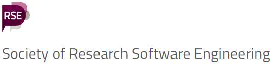{width=20%}](https://society-rse.org/)
---
Mentee, [Society of Research Software Engineering Pilot Mentorship Programme](https://society-rse.org/events/pilot-mentoring-programme/), November 2021 – July 2022: This is a 9-month non-technical mentoring program on topics such as personal development, communication, leadership, and career direction broadly in the field of Research Software Engineering. Working under the mentorship of Michelle Barker to further develop the community aspect of the RSE Asia Association of the RSE Asia Association.

- [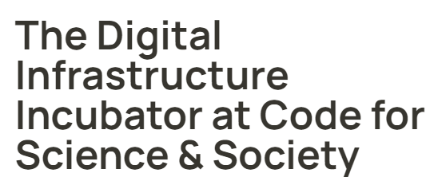{width=20%}](https://incubator.codeforscience.org/)
---
[Cohort participant, Digital Infrastructure Incubator](https://incubator.codeforscience.org/cohort), November 2021 – April 2022, Code for Science & Society (CS&S). Mentor: Rayya El Zein.

- [{width=20%}](https://openlifesci.org/)
---
[Project Co-Lead, RSE Asia Association, Open Life Science Cohort-4](https://openlifesci.org/ols-4/projects-participants/). Mentor: Anne Fouilloux.

- Project Lead, R-Ladies Global, October 2020 -- February 2022.

- Chapter Activity Tracking, R-Ladies Global, February 2020 -- September 2020.

- Diversity Scholar, RStudio::Global 2021 conference.

$~$

#### Published Articles, Reports, Blogs, Research

- [R Can Use Your Help: Translating R Messages](https://blog.r-project.org/2022/07/25/r-can-use-your-help-translating-r-messages/), Heather Turner and Saranjeet Kaur, Published: 2022

- [Conditional Duration Models for High-Frequency Data: A Review on Recent Developments](https://onlinelibrary.wiley.com/doi/abs/10.1111/joes.12261), Saranjeet Kaur Bhogal and Ramanathan Thekke Variyam, Published: 2018