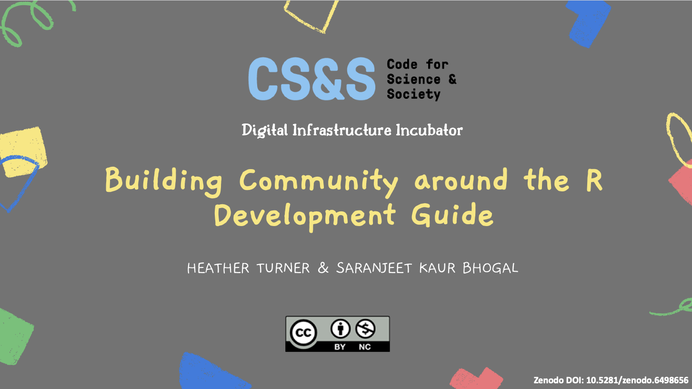

[Slides](https://zenodo.org/records/6498656#.Ym1-yu1BxPZ)

<iframe width="560" height="315" src="https://www.youtube.com/embed/5fyA_2sg07M?si=ZxN8fh3RWL869xNF&amp;start=2463" title="YouTube video player" frameborder="0" allow="accelerometer; autoplay; clipboard-write; encrypted-media; gyroscope; picture-in-picture; web-share" referrerpolicy="strict-origin-when-cross-origin" allowfullscreen></iframe>

Presented the work and learnings from the inaugural Digital Infrastructure Incubator for the project on “[Building Community around the R Development Guide](https://www.codeforsociety.org/incubator/projects/building-community-around-the-r-development-guide)” at “[The Practice of Digital Infrastructure](https://www.codeforsociety.org/incubator/events/practice-of-digital-infrastructure)” session organised by Code for Science and Society. This presentation was alongside five other projects that participated in the Incubator cohort. This work was funded by the Code for Science and Society.