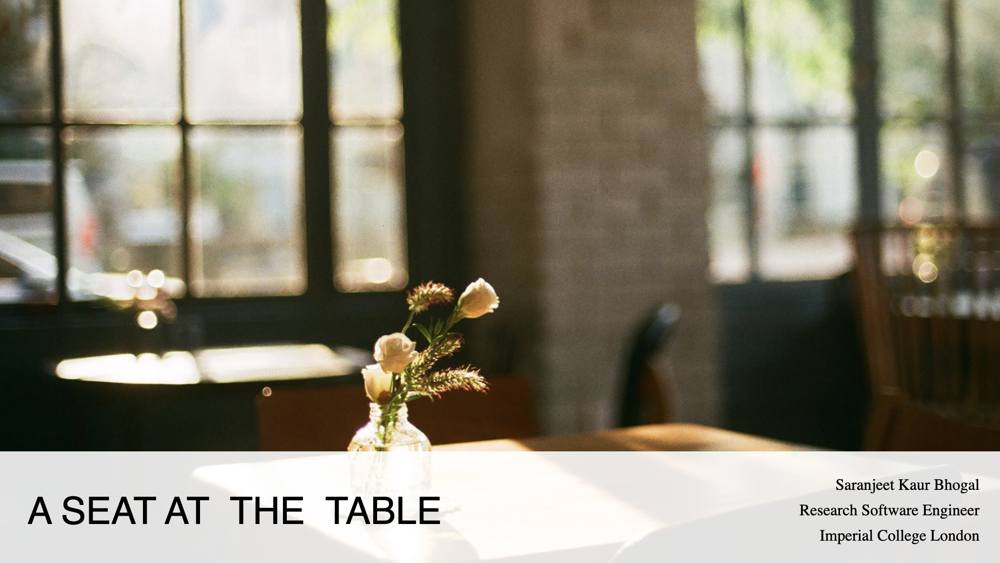

[Slides](https://zenodo.org/records/18433833)

[{width="478"}](https://zenodo.org/records/18433833)

This session was presented at the [WHPC breakfast session](https://womeninhpc.org/events/ciuk-2025-whpc-breakfast) at [CIUK 2025](https://www.sc.stfc.ac.uk/ciuk-2025/) in Manchester, UK, December 2025.

## Abstract

In research computing, what does "getting a seat at the table" really mean? For women in digital research technical professional (dRTPs) roles, that table can sometimes feel out of reach. In this short talk, I'll share some reflections from my own journey in research computing and community building.
