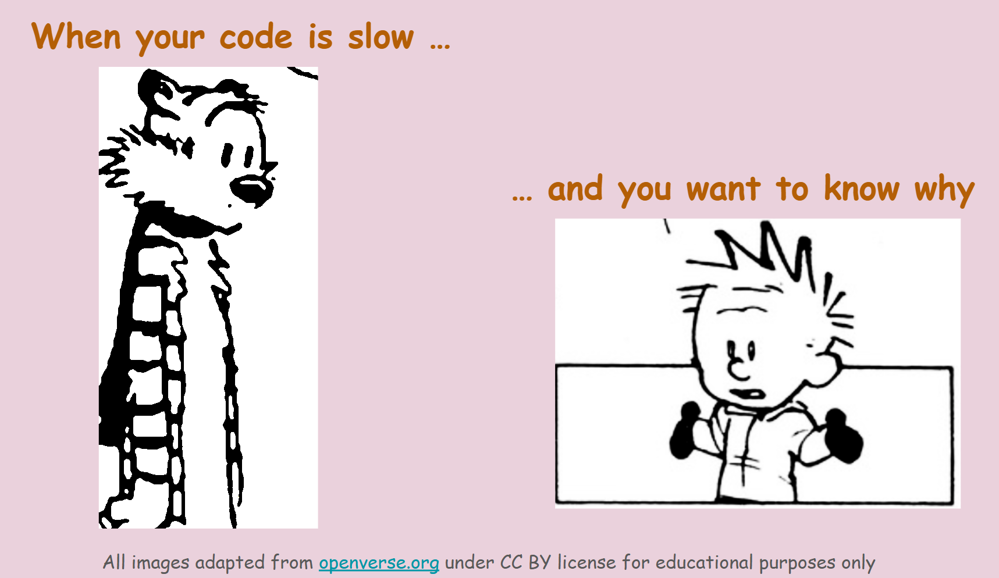

[Slides]()

{width="478"}

This session was presented at the [Belfast Linux User Group Technical meetup](https://www.meetup.com/belfast-lug/events/314229862/) in Ulster University, Belfast, Northern Ireland, April 2026.

## Abstract

Have you written a Python code that works, but runs slower than you expected? In this talk, we will explore why some code is slow and how to find the bottlenecks. You will learn how to profile your code, discover the parts that take the most time, and understand how to optimise it. We will cover practical examples and tips to help write more efficient Python code.

## Who is this talk for?

This talk is intended for software professionals and researchers who write code as a part of their work. Basic familiarity with Python is expected.