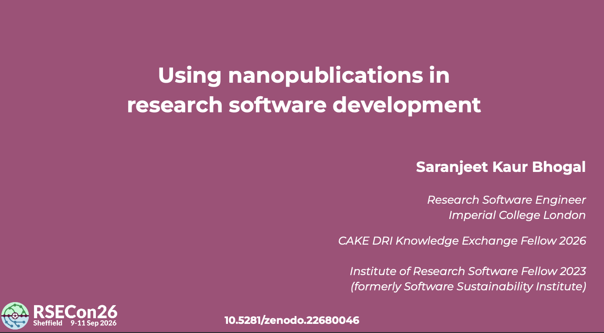

[Slides](https://zenodo.org/records/22680046)

[{width="478"}](https://zenodo.org/records/22680046)

This talk was presented at the tenth annual [Research Software Engineering conference (RSECon26) in Sheffield](https://rsecon26.society-rse.org), UK, September 2026.

## Abstract

Nanopublications are small, structured pieces of knowledge that provide persistent, world-wide accessible identifiers for data sets, events, software, etc. They can be used to capture research information such as hypotheses, claims, negative results, and opinions that would usually go unpublished. Each nanopublication contains three main parts: an “assertion”, the “provenance” of that assertion, and the “publication info” describing the nanopublication itself.

The nanodash project provides several reusable templates to create a nanopublication. This session will introduce the nanopublication template for a research software development plan.

The session is aimed at researchers, research software engineers, and developers interested in improving how software knowledge is documented.

## Prerequisites

No prior experience with nanopublications is required. The session will be an introductory walkthrough of using nanopublications. A basic understanding of the research software development process will be helpful but not essential.

## Outcomes

Attendees will gain an introduction to using nanopublications within the research software development cycle.

## Acknowledgements

The nanopublication template for the research software development plan was created by Saranjeet Kaur Bhogal and Christian Meesters, during the Open Science Retreat Global edition 2026 in Machynlleth, Wales, United Kingdom. The introductory materials on nanopublication are available on https://github.com/SaranjeetKaur/nanopub_101. A report on this work is available at https://doi.org/10.5281/zenodo.19604908.
