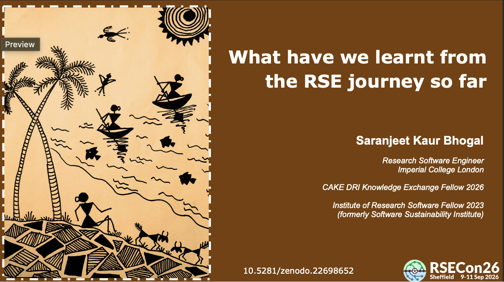

[Slides](https://zenodo.org/records/22698652)

[{width="478"}](https://zenodo.org/records/22698652)

This is an invited plenary lightning talk at the tenth annual [Research Software Engineering conference (RSECon26) in Sheffield](https://rsecon26.society-rse.org), UK, September 2026.

## Abstract

The [international RSE survey](https://www.software.ac.uk/news/2026-international-rse-survey) is an annual survey that collects data on the demographics, skills, practices, and experiences of RSEs around the world. The survey has been conducted since 2016 providing an opportunity to track the evolution of the RSE role over time. This presentation is based on an analysis report titled "[What have we learnt from the RSE journey so far](https://saranjeetkaur.github.io/RSE_historical_analysis/)" of the [RSE survey data](https://github.com/softwaresaved/RSE_survey_longitudinal/) from 2016-2022.

This analysis work won the [RSE Data Competition](https://www.software.ac.uk/news/rse-data-competition-winner-announced) in 2026.